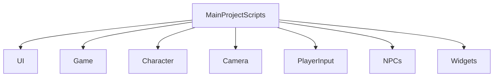
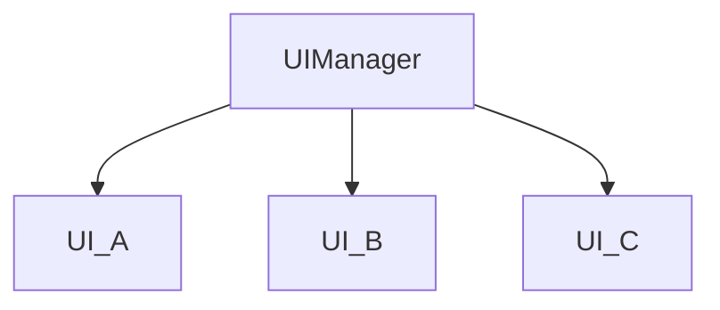
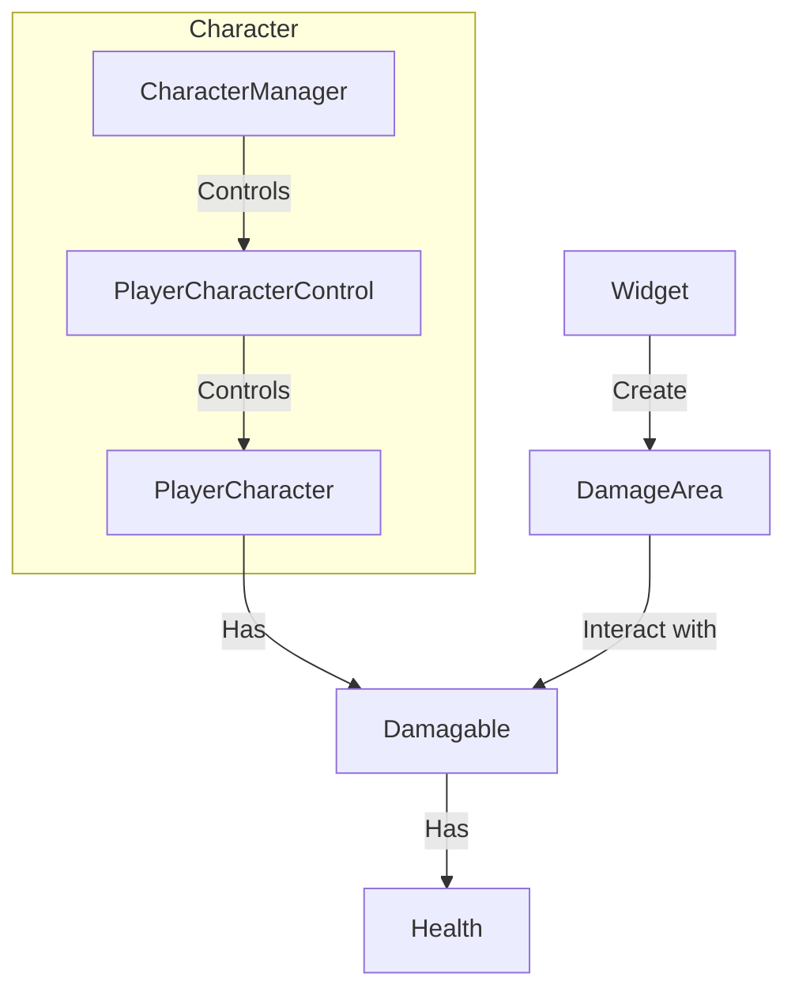

# Incantation 需求文档

[toc]

## 架构层次

### Managers

Manager of Managers(MOM)架构模式将应用分为如下的几个模块，应当尽可能地保证每个Manager的独立性，下面列出几类全局Manager。

#### MainManager

所有Managers的统一访问入口，静态，应保证每一个manager拥有唯一的全局访问器（全局实例）。

#### EventManager

系统事件的注册、监听与广播。对于要使用事件系统的模块，应当在Awake调用时获取到全局EventManager实例。

对于一种可能存在的的事件，它应当继承与GameEvent虚基类，并可以拥有类内部的成员变量，如下所示：

```C#
public class GameEvent
{
}
public class GameOverEvent : GameEvent
{
    public bool Win;
}
```

所有的继承自GameEvent的游戏内事件登记在静态类Events中。

```C#
public static class Events
{
    public static GameOverEvent GameOverEvent = new GameOverEvent();
    public static PlayerDeathEvent PlayerDeathEvent = new PlayerDeathEvent();
    public static EnemyKillEvent EnemyKillEvent = new EnemyKillEvent();
    public static PickupEvent PickupEvent = new PickupEvent();
    public static AmmoPickupEvent AmmoPickupEvent = new AmmoPickupEvent();
    public static DamageEvent DamageEvent = new DamageEvent();
    public static DisplayMessageEvent DisplayMessageEvent = new DisplayMessageEvent();
    ...
}
```

事件的监听者如下地向事件系统注册：

```C#
EventManager.AddListener<AllObjectivesCompletedEvent>(OnAllObjectivesCompleted);
            EventManager.AddListener<PlayerDeathEvent>(OnPlayerDeath);
```

其中参数为监听者在事件触发后调用的函数，该函数参数为对应事件的类，比如上面的例子中，函数的参数即为AllObjectivesCompletedEvent、PlayerDeathEvent。特殊信息可以如此地通过事件类内部的成员进行传递。

处于优化内存的考虑，模块在销毁时时(Ondestroy),应当向EventManager声明它不再需要监听事件。

```C#
EventManager.RemoveListener<AllObjectivesCompletedEvent>(OnAllObjectivesCompleted);
EventManager.RemoveListener<PlayerDeathEvent>(OnPlayerDeath);
```

事件的触发者如下地告知其他模块：它不需要获取EventManager实例，除非它同时也是监听者。

```C#
EventManager.Broadcast(Events.AllObjectivesCompletedEvent);
```

监听者调用静态函数Broadcast告知EventManager它要触发哪一类事件。在此之前，它可以修改Events中对应的静态类的成员来给监听者传递信息。

#### PlayerInputManager

玩家键入管理器。所有试图获取玩家当前输入的模块都应当经由此模块。PlayerInputManager应当提供如下功能：

1. 虚拟功能到实际键位的转换。

   如，对于控制玩家向前移动的功能MovingForward，PlayerInputManager将其与KeyCode.W进行对应。使用Enum记录逻辑功能，并在针对特定系统的Input脚本中完成对应。比如，在Windows平台上的对应脚本称为WindowsPlayerInput，MAC称为MACPlayerInput。

2. 热键冲突管理。

   PlayerInputManager可以让多个逻辑功能对应到一个键位，但必须避免冲突，比如，当W在一个场景中拥有多个逻辑功能时，PlayerInputManager可以拒绝这种键位配置，或进行其他冲突避免操作。逻辑上的冲突不属于本模块的管理范畴，比如，游戏暂停时，玩家将不能控制角色，但这一限制应当由Player控制器完成。

3. 热键的动态修改。

   给予玩家接口，使得玩家可以在游戏中修改操作键位。这一功能应当配合UI模块共同协作完成。

#### GameFlowManager

管理游戏主逻辑。

#### ObjectiveManager

管理游戏目标，即游戏进程的触发条件。对于每一个游戏中的Objective，将其注册在ObjectiveManager，并通过事件系统通知对应的模块进行处理。

所有的Objective应当继承自虚基类Objective。

#### WidgetManager

WidgetManager管理游戏过程中所有可以互动的物件，包括飞行道具（可附加伤害）、可拾取道具以及玩家技能的实体等。对于每一样可互动道具，它都应当继承自Widget虚基类。在Widget虚基类下，可以再细分为Collectables(可收集道具)、Playables(可互动道具)、FlyingObject(飞行物)、IncantationWidget(玩家技能)。

#### AudioManager

管理音效。

#### CharacterManager

管理玩家控制的角色。

#### NPCManager

管理所有NPC角色。

#### NavigationManager

管理自动寻路系统。

#### UIManager

管理UI界面。

所有的Manager作为Empty GO挂载到某一特定空对象上，整体的文件架构如图所示




### Camera

本目录下的脚本隶属于namespace Unity.NJUCS.Camera。

Camera模块应当实现以下的内容：

1. 角色视角的转换：包括自由视角、第三人称跟随视角等，且玩家应当可以在游戏中便捷的调整他所看到的视角。暂时不考虑第一人称视角的实现。

### UI

需求：指南针，人物头像+血条(玩家、敌人)。

实现GUI。UI模块控制着所有游戏内UI场景，包括玩家HUD、Menu、屏显信息等。UI模块应当能够将内部模块的信息及时的反馈到UI界面上。

屏幕上的每一个部件都应当有一个对应的控制脚本。每一个独立UI对应该目录下的一个子目录。




### Character

本模块负责玩家控制的角色。

使用骨骼-大脑分离式的系统架构，以xxx控制某一对象的实体部分，由xxxControl脚本完成对该实体的实际控制。以本模块为例，PlayerCharacter对象作为PlayerCharacterControl的成员存在，PlayerCharacterControl完成逻辑控制，调用PlayerCharacter的Move、Jump等函数完成实体操作。

而CharacterManager管理场景中的所有Character。

动画控制器应当直接受PlayerCharacter中的成员变量控制。



### Game

需求：关卡制

包含所有共享的游戏组件，包括：

1. Audio

   负责游戏各种音效

2. ParticleSystem

   负责所有粒子特效

3. GameFlow/Objectve

   游戏逻辑

4. Health/Energy

   生命值/法力值系统，该系统为玩家/NPC通用。

5. DamegeArea/Damagable

   玩家的技能，子弹(投掷物)造成伤害的方式应当是：在碰撞或任何其他条件触发后在场景中创建一片DamageArea，DamageArea再对与该区域碰撞的Damagable物体进行反应，使得拥有Damagable的对象“受伤”。

   角色(玩家、NPC)、生命值系统、造成伤害的物品之间的关系应当是：

   1. 角色拥有Damagable属性，即Damagable挂载到对应的对象上，而每个Damagable脚本操作对应角色的Health属性
   2. 造成伤害的物品(如Widget::Bullet)在触发某些条件后销毁并创造出一片持续一段时间的DamageArea，DamageArea使用Raycast或碰撞检测来判定与它接触的所有对象，如果对象具有Damagable属性，调用对应的接口，将控制权交给Damagable，由后者负责让相应的角色“扣血”。
   3. 同理，血量回复也可以运用此原理。PlayableObject在碰到一个具有Damagable属性的对象后，调用Damagable.Heal让对应的角色回复生命。
   4. 法力的损耗、回复直接对Energy操作即可，Energy直接挂载在对应角色上。

### PlayerInput

如PlayerInputManager中所述，PlayerInputManager.cs作为外界获取玩家输入的接口，而PlayerInputManager再根据所处平台将控制权转交给相应的WindowsInput、MacInput等类。

### NPCs

与Character类似，采用骨骼-大脑分离式的系统架构，分离实体部分和控制器部分。NPC自动寻路、自动攻击的逻辑也位于此模块。

结构类似Character。

### Widgets

道具类，暂时可分为PlayableWidget与FlyingWidget两大类，分别为可互动道具以及玩家技能。比如，玩家有一个技能是向面前的锥形区域内发射飞行物，那么发射出的**每一个飞行物(弹片)都是一个Widget->FlyingWidget**，相应地计算Widget对应的伤害衰减、伤害来源等。

## 美术管理

## 预制体管理

## 动画控制

## 场景管理


wxk: Character、Camera

zjq: Widget

dsh: NPC

wjy: UI

lyp: 其他